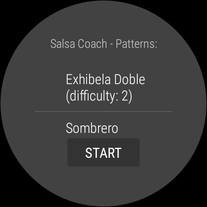

# Salsa Coach Wear OS

  

A sample Wear OS companion app for the Salsa Coach application ! - https://one-week-apps.com/salsa-coach/

# The App

Salsa Coach Wear OS is a Salsa application tailored to help Salsa dancers to remember and master key salsa moves!  
 
• Get a list of key salsa moves with a specific vibration attached to each move

• Start shuffled vibration patterns corresponding to moves list to get moves hints while dancing

